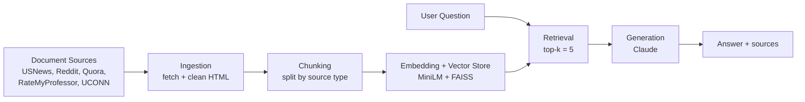

# Architecture — The Unofficial Guide

```mermaid
flowchart LR
    A[Document Sources<br/>USNews, Reddit, Quora,<br/>RateMyProfessor, UCONN] --> B[Ingestion<br/>fetch + clean HTML]
    B --> C[Chunking<br/>split by source type]
    C --> D[Embedding + Vector Store<br/>MiniLM + FAISS]
    E[User Question] --> F[Retrieval<br/>top-k = 5]
    D --> F
    F --> G[Generation<br/>Claude]
    G --> H[Answer + sources]
```
